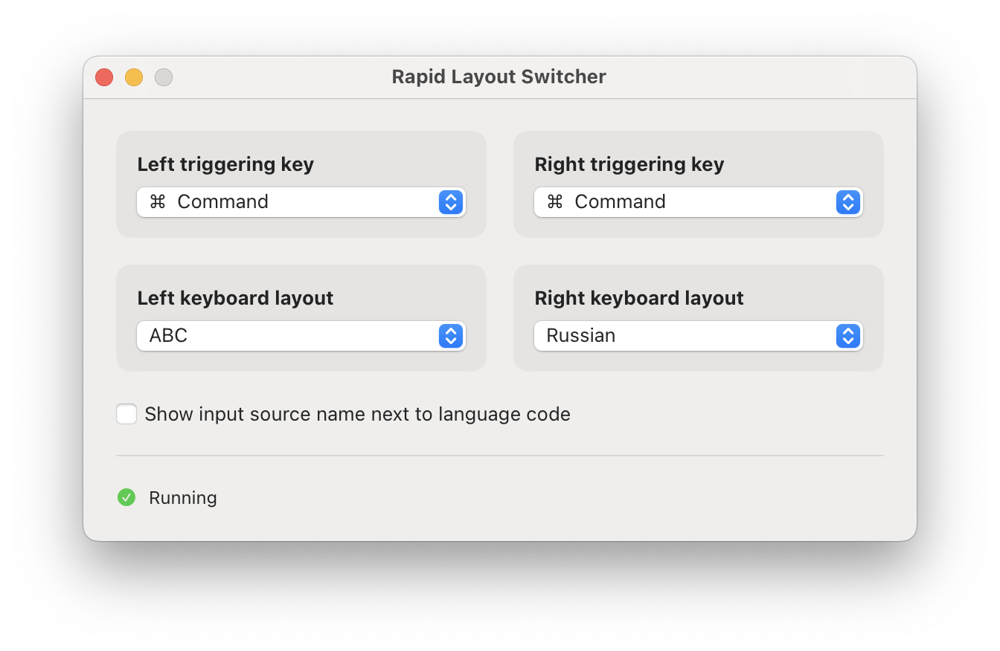
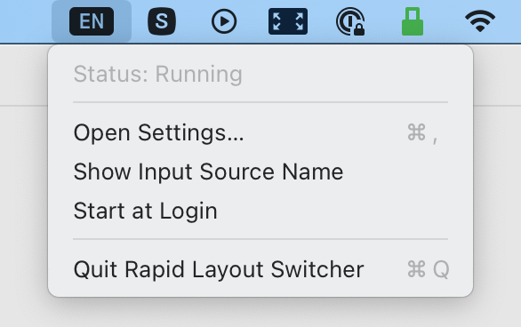

# Rapid Layout Switcher

Rapid Layout Switcher is a small macOS menu-bar app for switching keyboard layouts by tapping a modifier key by itself.

Assign one layout to a left-side modifier and another layout to a right-side modifier. For example:

- Tap left Command to switch to ABC.
- Tap right Command to switch to Russian.
- Regular keyboard shortcuts continue to work normally.

## Getting started

1. Open Rapid Layout Switcher.
2. Allow **Input Monitoring** when macOS asks. This permission is required to detect standalone modifier-key taps.
3. Choose a triggering key and keyboard layout for each side.
4. Close the settings window. The app continues running in the menu bar.

The available layout menus use the input sources currently enabled in **System Settings → Keyboard → Text Input**.

## Menu-bar indicator

The menu-bar badge always shows the language code for the current input source, such as `EN` or `RU`. Enable **Show input source name next to language code** if you also want the layout name displayed.

Open the menu-bar item to change that option, reopen Settings, enable **Start at Login**, or quit the app.

## Privacy

Rapid Layout Switcher uses a listen-only keyboard event monitor. It does not modify or generate keyboard events, execute scripts, or require Accessibility permission.
